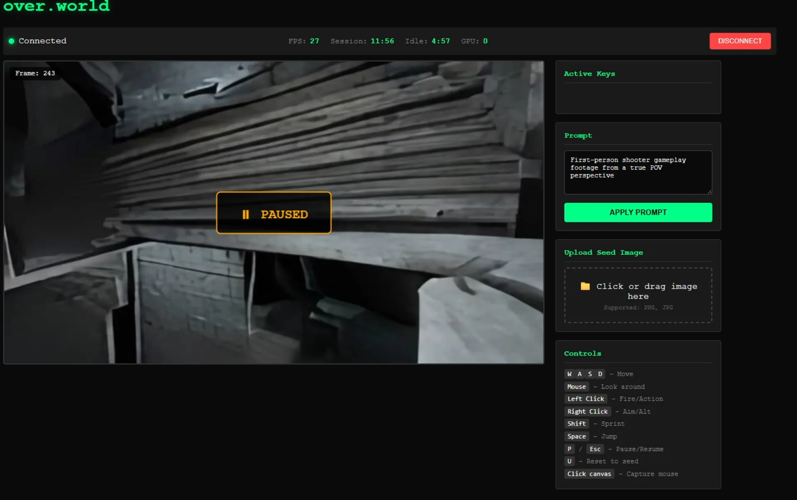

# over.world Hackathon Client

A standalone HTML client for interacting with over.world's real-time world model inference system. This client connects to GPU inference servers via WebSocket and allows you to control and explore AI-generated environments in real-time.



## Quick Start

1. **Get the passphrase** — You'll receive the passphrase from an event admin during the hackathon
2. **Download** `hackathon-client.html` from this repo
3. **Open in browser** — Double-click the HTML file or open it in Chrome/Firefox/Edge
4. **Enter passphrase** and click **Connect**
5. **Click the canvas** to capture your mouse and start controlling the world

That's it. No installation, no dependencies, no build step.

---

## Interface Overview

### Metrics Bar

| Metric | Description |
|--------|-------------|
| **FPS** | Frames per second received from the server. Typical range: 20-30 fps |
| **Session** | Time remaining in your session. Max session length is **15 minutes** |
| **Idle** | Time until auto-disconnect due to inactivity. Resets on any input. Default: **5 minutes** |
| **GPU** | Which GPU slot (0-7) you're connected to on the current machine |

### Session & Idle Timers

- **Session Timer (15 min max)**: To ensure fair access for all participants, each connection is limited to 15 minutes. When time runs out, you'll be disconnected and can reconnect if slots are available.

- **Idle Timer (5 min)**: If no keyboard/mouse input is detected for 5 minutes, the GPU is released for others. Any input resets this timer. The timer changes color as it decreases:
  - 🟢 Green: > 1 minute remaining
  - 🟡 Yellow: < 1 minute remaining  
  - 🔴 Red: < 30 seconds remaining

---

## Controls

### Movement & Actions

| Key | Action |
|-----|--------|
| `W` `A` `S` `D` | Move forward/left/backward/right |
| `Space` | Jump |
| `Shift` | Sprint |
| `Mouse` | Look around (requires pointer lock) |
| `Left Click` | Fire / Primary action |
| `Right Click` | Aim / Secondary action |

### System Controls

| Key | Action |
|-----|--------|
| `P` or `Esc` | Pause / Resume inference |
| `U` | Reset to seed image |
| Click canvas | Capture mouse (pointer lock) |

### Sidebar Controls

- **Prompt**: Enter a text prompt describing the scene/style you want, then click "Apply Prompt"
- **Upload Seed Image**: Drag & drop or click to upload a PNG/JPG image as the starting frame, then click "Upload & Reset"

---

## For Developers

This client is a **reference implementation**. You're encouraged to modify it, build your own client, or integrate the protocol into other applications. As long as your implementation sends and receives the correct WebSocket messages, it will work with the inference servers.

### Connection Flow

```
1. GET /claim?key={passphrase}     → Returns { gpu, port, session_id, expires_in }
2. Connect WebSocket to ws://{ip}:{port}/ws?session_id={session_id}
3. Exchange messages (see protocol below)
4. POST /release { session_id }    → Frees the GPU slot
```

### Router Endpoints

| Endpoint | Method | Description |
|----------|--------|-------------|
| `/claim?key={passphrase}` | GET | Request a GPU slot. Returns port and session_id |
| `/release` | POST | Release your GPU slot. Body: `{ "session_id": "..." }` |
| `/heartbeat?session_id={id}` | GET | Keep session alive, get remaining time |
| `/status?key={passphrase}` | GET | Check available GPU slots |

### Claim Response

```json
{
  "success": true,
  "gpu": 0,
  "port": 8080,
  "session_id": "abc123...",
  "expires_in": 900,
  "ws_url": "/ws"
}
```

Error responses:
- `{ "success": false, "error": "invalid_key" }` — Wrong passphrase
- `{ "success": false, "error": "no_gpu_available" }` — All slots occupied

---

## WebSocket Protocol

All messages are JSON. The `type` field determines the message kind.

### Client → Server Messages

#### Control Input
```json
{
  "type": "control",
  "buttons": ["W", "SHIFT", "MOUSE_LEFT"],
  "mouse_dx": 5.0,
  "mouse_dy": -2.0
}
```
- `buttons`: Array of currently pressed keys/buttons
- `mouse_dx`, `mouse_dy`: Mouse movement delta (from pointer lock)

Valid button values:
- Letters: `A`-`Z`
- Special: `SPACE`, `SHIFT`, `CONTROL`, `ALT`, `ESCAPE`
- Mouse: `MOUSE_LEFT`, `MOUSE_MIDDLE`, `MOUSE_RIGHT`

#### Prompt
```json
{
  "type": "prompt",
  "prompt": "First-person shooter gameplay footage from a true POV perspective"
}
```

#### Seed Image
```json
{
  "type": "seed_image",
  "data": "<base64-encoded PNG or JPG>"
}
```
Note: Only PNG and JPG formats are supported. Other formats will be rejected.

#### Reset
```json
{
  "type": "reset"
}
```
Resets inference back to the current seed image.

#### Pause / Resume
```json
{ "type": "pause" }
{ "type": "resume" }
```

### Server → Client Messages

#### Frame
```json
{
  "type": "frame",
  "data": "<base64-encoded JPEG>",
  "frame_id": 243
}
```
Render this as an image on your canvas. Frames arrive at ~20-30 fps.

#### Status
```json
{
  "type": "status",
  "message": "Model loaded"
}
```

#### Timeout Warning
```json
{
  "type": "timeout_warning",
  "remaining": 60
}
```
Sent when session is about to expire.

#### Session Expired
```json
{
  "type": "session_expired"
}
```
Connection will close after this message.

#### Error
```json
{
  "type": "error",
  "message": "Invalid image format"
}
```

---

## Building Custom Clients

### Minimal Example (JavaScript)

```javascript
// 1. Claim a GPU
const claimRes = await fetch(`http://${SERVER_IP}:8000/claim?key=${PASSPHRASE}`);
const { port, session_id } = await claimRes.json();

// 2. Connect WebSocket
const ws = new WebSocket(`ws://${SERVER_IP}:${port}/ws?session_id=${session_id}`);

// 3. Handle frames
ws.onmessage = (e) => {
  const msg = JSON.parse(e.data);
  if (msg.type === 'frame') {
    const img = new Image();
    img.src = 'data:image/jpeg;base64,' + msg.data;
    // Draw to canvas...
  }
};

// 4. Send input
ws.send(JSON.stringify({
  type: 'control',
  buttons: ['W'],
  mouse_dx: 0,
  mouse_dy: 0
}));

// 5. Release on exit
window.addEventListener('beforeunload', () => {
  navigator.sendBeacon(
    `http://${SERVER_IP}:8000/release`,
    new Blob([JSON.stringify({ session_id })], { type: 'application/json' })
  );
});
```

### Tips

- **Release your GPU** — Always call `/release` when done. Use `sendBeacon` for page unload
- **Handle disconnects gracefully** — The server may disconnect you for idle timeout or session expiry
- **Validate images client-side** — Only PNG/JPG are supported. Uploading other formats will be rejected
- **Keep inputs flowing** — The idle timer resets on any control/prompt/image message

---

## Troubleshooting

| Issue | Solution |
|-------|----------|
| "Invalid passphrase" | Double-check the passphrase from your event admin |
| "All slots full" | Wait for a slot to free up, or try again in 2 minutes |
| Connection drops immediately | Check browser console for errors; ensure WebSocket isn't blocked |
| No frames appearing | Click the canvas to establish focus; check if paused |
| Mouse not working | Click the canvas to enable pointer lock |
| Low FPS | Expected range is 20-30 fps depending on server load |

---

## File Structure

```
overworld-hackathon/
├── README.md              # This file
├── hackathon-client.html  # The standalone client
└── docs/
    └── interface-preview.png
```

---

## License

This hackathon client is provided for event participants. Please contact Wayfarer Labs for commercial use inquiries.

---

**Questions?** Find an event admin or reach out to the Wayfarer Labs team.
